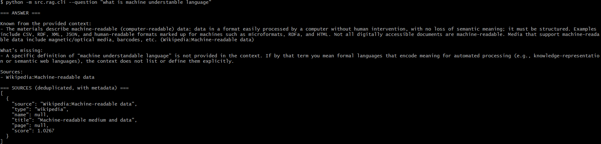
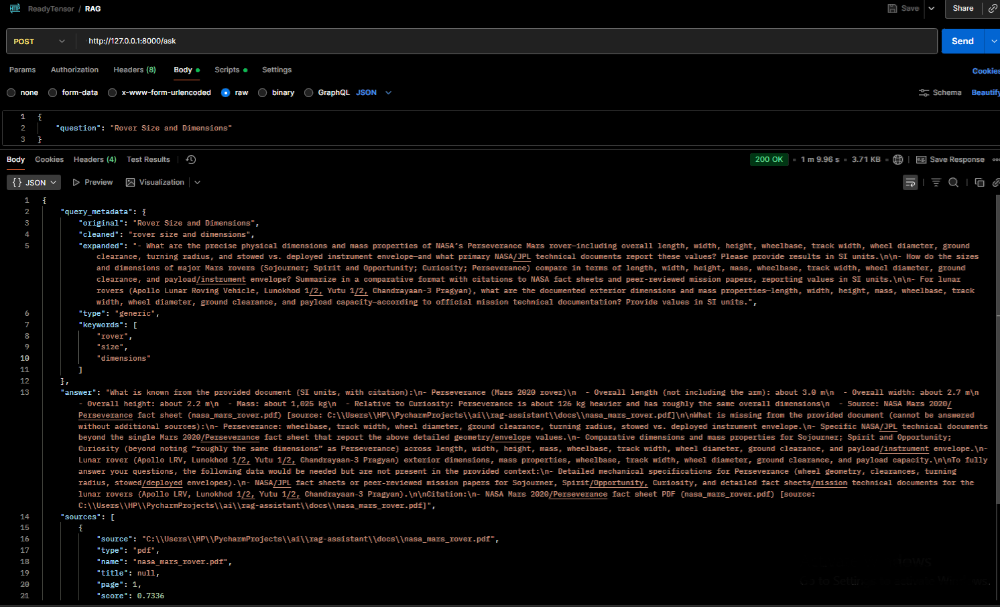
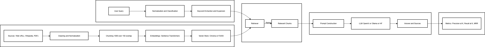

# RAG Assistant: A Modular Framework for Building and Evaluating Retrieval-Augmented Generation Systems


> **TL;DR Workflow:**  
> ```
> [User Query] → [Query Processing] → [Retriever: Chroma/FAISS] → [Context + Prompt] → [LLM] → [Answer + Sources]
> ```
> Production-ready RAG pipeline using LangChain, Chroma/FAISS, and modular preprocessing.

A production-ready **Retrieval-Augmented Generation (RAG)** system that:

- Uses **Chroma** (default) or **FAISS** for efficient vector search  
- Embeds and indexes a corpus (Web URLs + Wikipedia + PDFs)  
- Exposes a complete **LangChain** pipeline:  
  `User Question → Query Processing → Retrieval → Prompt Construction → LLM Response`  
- Provides both **CLI** and **FastAPI REST** interfaces


---
##  Why This Project?

I built this project to explore how production-grade RAG systems are structured.  
It demonstrates:
- **Modular architecture** (ingestion, retrieval, generation layers)
- **LangChain integration** with pluggable vector stores (Chroma, FAISS)
- **Advanced features** like query preprocessing and retrieval evaluation
- **Robustness** via staleness detection and deterministic ingestion
- **Deployment readiness** through Makefile automation and CI-friendly structure

---
## Tech Stack

- **Language:** Python 3.10+
- **LLM Orchestration:** LangChain
- **Vector Stores:** Chroma (default), FAISS
- **Embeddings:** sentence-transformers/all-MiniLM-L6-v2
- **API:** FastAPI
- **Testing:** pytest
- **Automation:** Makefile targets for ingestion, queries, cleaning, evaluation and testing
---
## Model Choice Rationale
| Component      | Default                                  | Reason                                                                        |
| -------------- | ---------------------------------------- | ----------------------------------------------------------------------------- |
| **Embeddings** | `sentence-transformers/all-MiniLM-L6-v2` | Lightweight (22 MB), fast inference ≈ 80% of BERT’s accuracy at 1/10 the cost |
| **LLM**        | Configurable (OpenAI / Ollama / HF)      | Modular design → can swap in local models for privacy or cost control         |
| **Vector DB**  | Chroma                                   | Open-source, persistent, and Python-native                                    |

```markdown
RAG Assistant supports multiple model providers to ensure both accessibility and flexibility:

| Provider | Why Chosen | Best For |
|-----------|-------------|----------|
| **OpenAI** | High-quality, consistent completions and reasoning accuracy | Cloud inference with GPT-5 |
| **Ollama** | Enables offline, privacy-preserving execution of models like LLaMA-3 | Local development and demos |
| **HuggingFace Inference API** | Supports open-source LLMs with flexible configuration | Custom model evaluation and experimentation |

Each model provider can be toggled in `configs/settings.yaml`.  
This modularity allows side-by-side testing and benchmarking across architectures.

```
## 📌 Quickstart

### 1️⃣ Prerequisites
- **Python** 3.10+
- (Optional) **Docker**
- One of the supported LLM backends:
  - **OpenAI** (requires `OPENAI_API_KEY` in `.env`)
  - **Ollama** (e.g., `llama3` running locally)
  - **HuggingFace Inference API** (requires `HUGGINGFACEHUB_API_TOKEN`)

---

### 2️⃣ Setup
#### Linux / macOS / Windows (PowerShell)
```bash
git clone <https://github.com/mohanelango/rag-assistant.git> rag-assistant
cd rag-assistant
python -m venv .venv && source .venv/bin/activate  # Windows: .venv\Scripts\activate
pip install -r requirements.txt
cp .env.example .env
```

Edit `.env` to select your preferred LLM provider (OpenAI / Ollama / HF).  
Optionally tune `configs/settings.yaml` for chunk size, retrieval `k`, or model parameters.

---
💻 Global Note on Commands (Cross-Platform)

This project provides a Makefile with shortcuts (make ingest, make ask, etc.).

Linux / macOS – Works out-of-the-box if you have GNU Make.

Windows – If make is not available, install it via:

<details> <summary> Install GNU Make on Windows</summary>

Scoop
```
Set-ExecutionPolicy RemoteSigned -Scope CurrentUser
irm get.scoop.sh | iex
scoop install make

```
Chocolatey:
```
choco install make
```

Or, run the equivalent Python commands directly, as shown below.
</details>

### 3️⃣ Ingest Your Corpus
With Make:
```bash
make ingest
```
Without Make (Windows fallback):
```
python -m src.rag.ingest
```
This will:
- Load all sources from `configs/sources.yaml`
- Chunk them into 1000-character blocks (150 overlap)
- Embed with `sentence-transformers/all-MiniLM-L6-v2`
- Build and persist a **Chroma vector store** at `./vectorstore/chroma_index/`

Smart Staleness Detection:

If you modify configs/sources.yaml or change embedding/chunking settings but forget to re-ingest,
the CLI and API will detect that your sources are newer than the last index build and display a warning:

⚠️ WARNING: sources.yaml was modified after the last ingestion.
Run `make clean && make ingest` to update your index before querying.

---
### 4️⃣ Query Processing

Before every query, the system preprocesses the user input for cleaner, more accurate retrieval.

Features

Normalization: Removes punctuation and redundant spaces

Classification: Detects query type (factual, conceptual, procedural)

Keyword Extraction: Identifies core retrieval terms

Optional Expansion: Uses your configured LLM (OpenAI / Ollama / HF) to paraphrase queries for better semantic match

Example
```
make ask Q="Explain how RAG improves LLM accuracy"
```
Output Includes
```
=== QUERY METADATA ===
{
  "type": "conceptual",
  "cleaned": "explain how rag improves llm accuracy",
  "expanded": "explain how retrieval-augmented generation improves accuracy and factual grounding in large language models",
  "keywords": ["explain", "rag", "improves", "llm", "accuracy"]
}
```
To enable query expansion in configs/settings.yaml:
```yaml
query:
  expand: true
```
---
### 5️⃣ Query the System (CLI):
With Make:
```bash
make ask Q="What is Retrieval-Augmented Generation and why is it useful?"
```
Without Make (Windows fallback):
```
python -m src.rag.cli --question "What is Retrieval-Augmented Generation and why is it useful?"
```

This prints:
- A context-aware generated answer
- A deduplicated list of sources from the Chroma index (with similarity scores)
> **ℹ️ Metadata Rich Output:**  
> Not just the source, but also:
> - `type` (url, wikipedia, pdf)
> - `name` (for PDFs, file name)
> - `page` (for PDFs, page number)
> - `title` (for Wikipedia, page title)
> - `score` (similarity score)
> 
> This provides traceability and helps reviewers verify that answers are well-grounded.

Sample CLI Output:

---

### 6️⃣ Serve via API
With Make:
```bash
make serve
```
Without Make (Windows fallback):
```
uvicorn src.rag.api:app --reload --port 8000
```
Query with:
```bash
curl -X POST http://localhost:8000/ask \
  -H "Content-Type: application/json" \
  -d '{"question":"Explain FAISS vs Chroma differences"}'
```

Sample API Output:


### 7️⃣ Retrieval Evaluation

To measure how well your retriever fetches relevant context, RAG Assistant includes a **Retrieval Evaluation** module.

### What It Does
- Computes **Precision@K**, **Recall@K**, and **Mean Reciprocal Rank (MRR)**.  
- Compares the retriever’s results against a known set of *relevant documents*.  
- Helps you assess how accurately your embeddings and chunking strategy are working.

### How to Use

1. Create an evaluation dataset at `data/eval_questions.json`:
   ```json
   [
     {
       "question": "What is Retrieval-Augmented Generation?",
       "relevant_docs": ["Wikipedia:Retrieval-Augmented Generation"]
     },
     {
       "question": "Who wrote Federalist Paper No. 10?",
       "relevant_docs": ["./docs/federalist_papers.pdf"]
     }
   ]
2. Run evaluation:

    With Make:
    ```bash
      make evaluate
    ```
    Without Make (Windows fallback):
    ```
    python -m src.rag.evaluate --settings configs/settings.yaml --evalset data/eval_questions.json
    ```
3. Example Output:
    ```makefile
    Precision@5: 0.80
    Recall@5: 0.75
    MRR: 0.67
    ```
Why It Matters:

Retrieval evaluation helps verify whether your vector store and embeddings retrieve the right context chunks.
You can experiment with:

Different embedding models

Chunk sizes / overlap

Retrieval k settings and compare metrics quantitatively.

---
### 8️⃣ Clean Vector Store (Optional)

If you want to reset and rebuild your index (e.g., after changing chunk size, sources, or embeddings):

With Make:
```bash
make clean
```
Clean a custom vectorstore (if you used VECTORSTORE_DIR):
```bash
make clean VECTORSTORE_DIR=./vectorstore/test_index
```
Without Make:
```bash
rm -rf vectorstore/chroma_index vectorstore/faiss_index
```
Tip: Always run make clean && make ingest after you modify configs/sources.yaml or change chunking/embedding settings.
This ensures you don't mix old and new embeddings in the same vector store.

### Why This is Important

- **Avoids stale embeddings** when sources, chunk size, or embedding model are changed  
- **Prevents index corruption** if you switch from FAISS ↔ Chroma  
- **Makes ingestion deterministic** — ensures results match new settings exactly  

---
### 9️⃣Testing
Run the test suite to validate ingestion, retrieval, and API endpoints:
```bash
make test
```
Run tests against a custom vectorstore directory (recommended for CI isolation):
```bash
make test VECTORSTORE_DIR=./vectorstore/test_index
```
---

---
### Overriding Config Files

You can switch to alternate configs (e.g., settings.prod.yaml, sources.alt.yaml) without changing code:
```
make ingest SETTINGS=configs/settings.prod.yaml SOURCES=configs/sources.alt.yaml
make ask Q="What is RAG?" SETTINGS=configs/settings.prod.yaml
```
Or with Python directly:
```
python -m src.rag.ingest --settings configs/settings.prod.yaml --sources configs/sources.alt.yaml
python -m src.rag.cli --question "What is RAG?" --settings configs/settings.prod.yaml

```

---
## TL;DR: How It Works
---
User Question
   │
   ▼
Query Processing (cleaning, classification, expansion)
   │
   ▼
Retriever (Chroma / FAISS)
   │
   ▼
Context + Question → Prompt Template
   │
   ▼
LLM (OpenAI / Ollama / HuggingFace)
   │
   ▼
Answer + Source List


This ASCII diagram is a high-level view of the full RAG flow.
For a detailed view, see [docs/architecture.md](docs/architecture.md)
___
## ⚙️ Configs

- `configs/settings.yaml` — embedding model, retrieval k, vectorstore path, query expansion  
- `configs/sources.yaml` — URLs (Ready Tensor guides), Wikipedia topics, PDFs

---

## Architecture Overview


> This high-level diagram illustrates how a user query moves through preprocessing, retrieval, and generation layers before producing an answer.

For a deeper explanation, see [`docs/architecture.md`](docs/architecture.md)

---
##  License

Distributed under the [MIT License](LICENSE).

