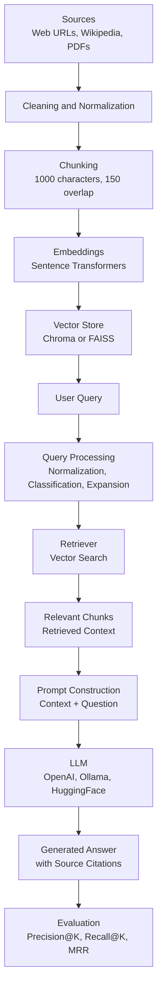

###  RAG Assistant Architecture: Design and Rationale

This document provides a detailed overview of the **RAG Assistant** architecture—a modular Retrieval-Augmented Generation framework built with LangChain.  
It aims to combine research-grade clarity with production-ready engineering principles, explaining each subsystem from ingestion to evaluation.


---
### Ingestion Pipeline

Purpose: Prepare high-quality embeddings for all source materials.

Flow:

1. Loaders

    WebBaseLoader — for Ready Tensor or other web URLs
    
    WikipediaLoader — for Wikipedia topics
    
    PyPDFLoader — for PDFs (supports multi-page documents)


2. Cleaning & Normalization

    Strips navigation text, boilerplate, and metadata
    
    Collapses redundant whitespace and ensures UTF-8 safety


3. Chunking

    Uses RecursiveCharacterTextSplitter
    
    Default size: 1000 characters, with 150-character overlap
    
    Balances retrieval granularity and contextual continuity


4. Embeddings

    Default model: sentence-transformers/all-MiniLM-L6-v2
    
    Embeddings computed and persisted deterministically


5. Vector Database

    Chroma (default) – persistent, easy to inspect locally
    
    FAISS – optional high-speed alternative
    
    Selection controlled via settings.yaml

Output:
A vector store containing document embeddings with rich metadata (source, type, title, page number, score).
---

### Query Processing Layer

Purpose: Normalize and enhance user input before retrieval to improve accuracy and contextual match.

Pipeline Steps:
1. Normalization:

    Removes punctuation, lowercases text, and trims whitespace.

2. Classification:

    Categorizes query as factual, conceptual, procedural, or comparative to aid prompt selection.

3. Keyword Extraction:

   Extracts high-signal terms for embedding-based retrieval.

4. Expansion (optional):

   Uses the configured LLM (OpenAI/Ollama/HuggingFace) to rewrite queries into semantically richer and research-oriented forms.
```yaml
query:
  expand: true
```
Example:

| Step     | Input                                                                                                         | Output |
| -------- | ------------------------------------------------------------------------------------------------------------- | ------ |
| Original | "Explain how RAG improves LLM accuracy"                                                                       | —      |
| Cleaned  | "explain how rag improves llm accuracy"                                                                       | —      |
| Expanded | "explain how retrieval-augmented generation improves factual accuracy and grounding of large language models" | —      |
| Type     | Conceptual                                                                                                    | —      |
| Keywords | ["rag", "llm", "accuracy"]                                                                                    | —      |
---

### Retrieval Layer

Purpose: Find the most relevant chunks from the vector database.

--- Retriever:

Built via
```
retriever = vectorstore.as_retriever(search_kwargs={"k": k})
```
where k controls the number of nearest chunks retrieved.

--- Vector Store:
Either Chroma or FAISS, configured in settings.yaml.

--- Similarity Metric:
Cosine similarity by default.

Output:

A ranked list of document chunks, each with metadata and similarity score.

---
### Prompt Construction & Generation

Purpose: Combine retrieved context and user query into a coherent prompt for the LLM.

Prompt Template:

```
System Instruction:
"You are a helpful assistant. Use the retrieved context below to answer accurately."

Context:
{{ retrieved_context }}

Question:
{{ user_query }}

```

LLM:

--- Supports OpenAI, Ollama, or HuggingFace

--- Configured via settings.yaml

--- Uses a hard fallback order for reliability

Output:

--- Natural-language answer

--- Deduplicated source attributions with metadata:

    Source, Type, Name, Title, Page, Score

**Design Rationale:**
The choice of prompt structure and model orchestration is informed by research on retrieval-augmented architectures (Lewis et al., 2020), emphasizing controlled grounding and factual precision.  
By explicitly separating retrieval from generation, the assistant ensures interpretability and verifiable attribution.

---

### Evaluation Layer

Purpose: Quantitatively assess retriever performance and overall RAG effectiveness.

Metrics:

Precision@K – fraction of retrieved documents that are relevant

Recall@K – fraction of relevant documents retrieved

Mean Reciprocal Rank (MRR) – measures ranking quality

Example Dataset (data/eval_questions.json):
```json
[
  {
    "question": "What is Retrieval-Augmented Generation?",
    "relevant_docs": ["Wikipedia:Retrieval-Augmented Generation"]
  },
  {
    "question": "Who wrote Federalist Paper No. 10?",
    "relevant_docs": ["./docs/federalist_papers.pdf"]
  }
]
```
Run Evaluation:
```bash
make evaluate

```
Sample Output:
```
Precision@5: 0.80
Recall@5: 0.75
MRR: 0.67

```
Use Case:
Helps test embedding models, chunk sizes, and k values empirically.
---
### Interfaces
1️⃣ Command-Line Interface (src/rag/cli.py)

Allows direct questions via CLI

Performs query preprocessing, retrieval, and generation

Returns structured JSON with answer and deduplicated sources

Detects stale vectorstore vs sources.yaml and warns if re-ingestion is needed

Example:
```
python -m src.rag.cli --question "What is Retrieval-Augmented Generation?"
```
2️⃣ REST API (src/rag/api.py)

Powered by FastAPI

Exposes /ask endpoint

Supports debug mode (?debug=true) to return only query metadata

Returns:

query_metadata

answer

sources

Example:
```
curl -X POST "http://localhost:8000/ask?debug=true" \
  -H "Content-Type: application/json" \
  -d '{"question":"Explain how RAG improves accuracy"}'
```

### High-Level System Diagram


---

### Summary

| Component            | Purpose                                   | Key Files                     |
| -------------------- | ----------------------------------------- | ----------------------------- |
| **Ingestion**        | Loads, cleans, chunks, and embeds sources | `src/rag/ingest.py`           |
| **Query Processing** | Cleans and expands user queries           | `src/rag/query_processing.py` |
| **Retrieval**        | Finds top-k relevant chunks               | `src/rag/chain.py`            |
| **Generation**       | Combines context + query into LLM prompt  | `src/rag/chain.py`            |
| **Evaluation**       | Tests retrieval quality                   | `src/rag/evaluate.py`         |
| **CLI**              | Local question-answering                  | `src/rag/cli.py`              |
| **API**              | REST-based access                         | `src/rag/api.py`              |

